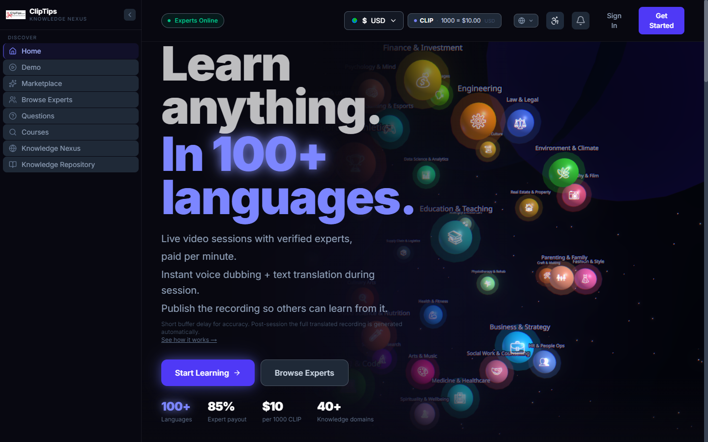
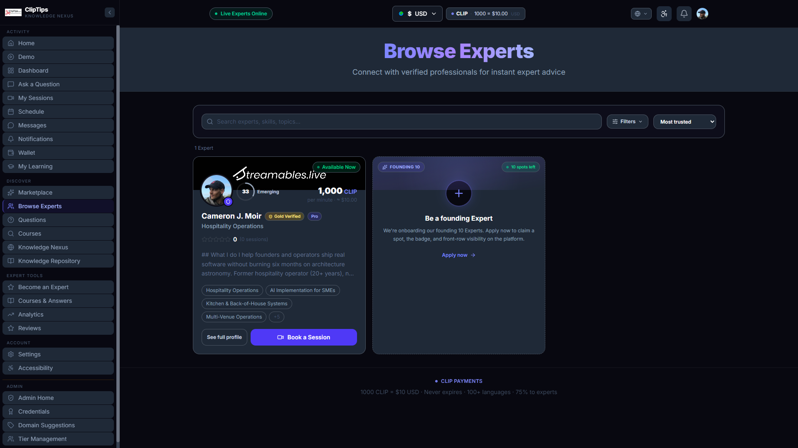
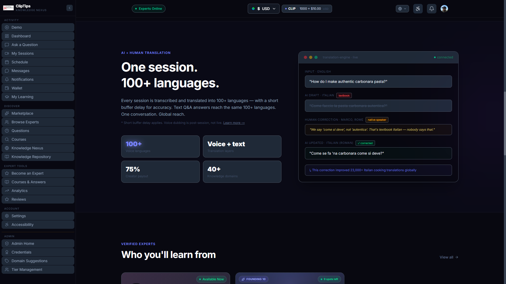
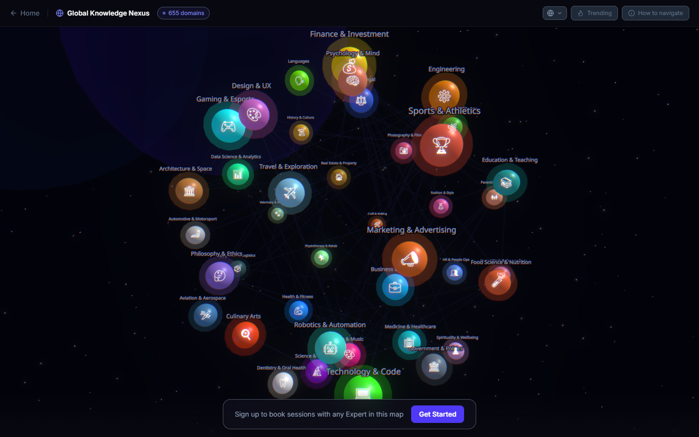
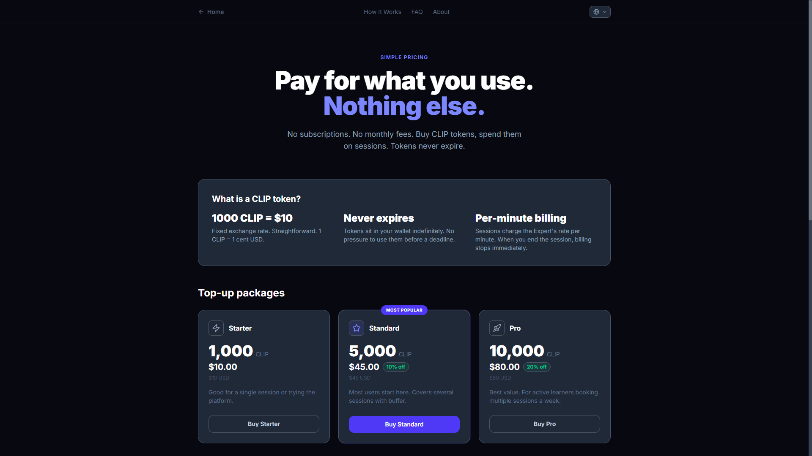
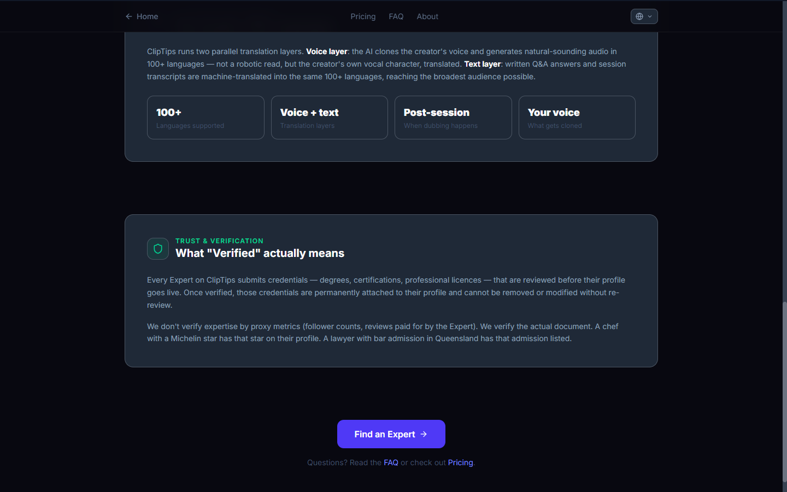

# ClipTips

**Live video marketplace with real-time AI translation.**
Book a verified expert by the minute, ask your question on camera, hear the answer in your own language — in their cloned voice.

*100+ languages. 75% creator payout. $10 per 1000 CLIP. 650+ knowledge domains. The Knowledge Map renders every domain as a sphere — click any to filter Experts.*

## What is this

The person who can answer your question exists somewhere in the world. They just don't speak your language.

ClipTips closes that gap. An Italian tiler, a Japanese pastry chef, a Queensland lawyer, a Brazilian surgeon — anyone with verifiable expertise can take live video sessions from askers worldwide, in any of 100+ languages. Voice is cloned and re-dubbed into the asker's language with subtitles running in parallel. Both sides speak naturally. Both sides understand.

Paid per minute. No subscriptions. No hidden fees. **75% of every session goes to the Expert.**

---

## How it works

### The three-sided flow

**Asker** signs up, tops up CLIP tokens (1000 CLIP = $10 USD flat), browses verified Experts by domain, books a session. During the call they see subtitles in their language and hear the Expert in their own cloned voice. After the session they can publish the recording into the Knowledge Repository for other askers to find.

**Expert** submits credentials for review (degrees, certifications, licences), passes Stripe Identity verification, connects a bank account via Stripe Connect, sets their own per-minute CLIP rate. Sessions are taken live, earnings hit their wallet, cashout on demand. **Pro tier** cashes to real money. **Scholar tier** keeps Teaching Credits on-platform for academics.

**Platform** takes 25%. Handles escrow, verification, dispute resolution, the translation pipeline (Deepgram + ElevenLabs + OpenRouter API costs), Stripe Connect orchestration.

*Browse Experts. Per-minute rate visible. Verification tiers (Gold Verified, Pro, Scholar) on every card. Trust score sits next to the avatar — calculated from identity verification, credentials, completed sessions, ratings, and Gold subscription.*

---

## Native vs Global Expert pools

Askers see two clearly-labelled pools when browsing.

**Native Experts** speak your language. Booking is direct, standard rate, no translation overhead. Italian asker, Italian Expert — they talk, both sides understand each other naturally.

**Global Experts** speak something else. Booking auto-enables live AI translation for the call. A modest premium covers the translation pipeline cost; the Expert's payout is unaffected (translation overhead comes entirely out of the platform's slice, not the Expert's).

You're never locked in either direction. If you book a Native Expert and realise mid-call you want translation anyway — for a topic that wandered outside the shared language — there's a **Switch to translated** button in the session header. Prorated fee on the spot for the remaining booked time. The translation engine kicks in instantly for the rest of the call.

The point is the entire world of expertise is reachable, not just the slice that happens to share your language.

---

## Live Interpreter Mode

**Voice-cloned, real-time cross-language conversation in production.**

Speaker A talks in English. Speaker B hears A's actual cloned voice — not a synth — speaking Vietnamese (or any of 100+ languages), with live captions running in parallel. End-to-end latency ~250-400ms thanks to Deepgram Flux streaming transcription + ElevenLabs Flash v2.5 voice synthesis. That's "feels truly conversational" territory.

Auto-engaged on cross-language bookings. Asker pays a transparent premium that covers the per-minute Deepgram + ElevenLabs + translation API cost; Experts still receive their full effective rate from the platform's slice. The platform absorbs the AI overhead so Experts never see it.

**Lipsync is live.** The speaker's video output gets mouth-region modified to match the translated audio so cross-language sessions stop feeling like dubbed foreign films. Built on MuseTalk (MIT-licensed Tencent 2024 model). The current pipeline runs via Sieve. A self-hosted variant is wired and waiting at the volume threshold where hosted infra economics tip — flip a config switch, no code change.

---

## The translation pipeline

Two layers run in parallel during every session.

**Voice layer.** The Expert's voice is cloned (ElevenLabs Multilingual / Flash v2.5 with cloning) and re-synthesised into the asker's target language. Not a robotic read — the Expert's own vocal character, speaking the asker's language.

**Text layer.** Spoken dialogue is transcribed (Deepgram Flux nova-3 streaming) and machine-translated (OpenRouter / Anthropic models) into 100+ languages as live captions. Both sides see them in real time.

**Post-session.** The full translated recording is regenerated from the complete transcript with higher-fidelity translation and re-dubbed cleanly, replacing the live version in the session record.

*The translation engine doesn't just MT-and-pray. AI proposes the textbook draft. Native speakers (here, Marco from Rome) correct it — "we say 'come si deve', not 'autentica'. That's textbook Italian — nobody says that." Native corrections feed back into the translation cache so the same phrase doesn't get re-mis-translated. Every correction compounds.*

---

## Verification and trust

No follower-count-as-credential nonsense. ClipTips verifies the actual documents.

- **Stripe Identity** for every user. One passport, one account. Kills the bot-army and sock-puppet-review problem at the door.
- **Credential review** for every Expert. Degrees, professional licences, certifications — all reviewed by admin, permanently attached to the profile.
- **Gold Verified** tier for deeper trust. $99/year subscription triggers a full background + credential audit. On approval, the gold badge lands on the public profile + 5 lifetime credential uploads included. Rejection is honest (refunded minus processing fees, no badge). Previously-approved Experts don't lose the badge if a later re-application is declined.
- **Trust scores** are computed live from identity verification, credentials, completed sessions, rating averages, Gold subscription status, and profile completeness — visible on every Expert card.

---

## The Knowledge Nexus

Every knowledge domain on the platform is rendered as an orbiting sphere on a live 3D starmap. Size scales with session activity. Click a domain to filter Experts. The taxonomy is expert-proposed and admin-reviewed so it stays clean as the platform grows.

*Live 3D map: 655 knowledge domains as orbiting spheres. WebGL via React Three Fiber on desktop, procedural SVG fallback on mobile. Domains are shaped + coloured by category, sized by activity. Click any sphere to drop into that domain's Expert list.*

---

## Simple pricing — pay for what you use

*1000 CLIP = $10 USD flat. Tokens never expire. Three top-up packages — Starter / Standard (10% off) / Pro (20% off). Per-minute billing — when you end the session, billing stops immediately.*

No subscriptions. No monthly fees. Cross-language sessions add a transparent premium that funds the AI translation pipeline — Experts always receive their full effective rate from the platform's 25% slice. The minimum any priced surface charges is $5, set by the Stripe-fee floor below which the 75/25 split stops working economically.

---

## How a session unfolds

*Find the right Expert → top up CLIP → connect via live video → AI dubs the conversation in real time → recording optionally publishes to the Knowledge Repository. The Expert teaches in their language; you follow in yours.*

---

## The Knowledge Repository

Post-session, the asker can choose to publish the full translated recording into the Knowledge Repository. Future askers searching the same question find the recording before they book a new session. The original Expert earns a passing bounty every time someone views the published answer. Translation runs automatically so a recording asked in English becomes a searchable Korean answer for a Korean viewer.

The marketplace gets better every time a session closes.

---

## Pooled bounties — chip in on questions that matter

Hard questions deserve real bounties. The hard part is the asker rarely knows what their question is worth — a constitutional-law analysis takes hours of bar-admitted attention; "what should I eat in Buenos Aires" is a 30-second answer. Asker self-pricing breaks the marketplace in both directions: undervalued questions never get answered, overvalued ones burn the asker's wallet for fluff.

ClipTips fixes this two ways.

**Fair-price suggestion when posting.** Write your question. Hit "Get fair price". An AI reads the question and proposes a bounty floor based on complexity, required expertise, and category. The platform enforces the floor server-side so trivial questions can't be priced as professional advice — and professional advice can't be lowballed into rot. The asker can always pay more.

**Anyone can chip in.** Once a question is posted, other users who want the same answer can join the bounty pool. The minimum chip-in is 50% of the asker's original bounty, so contributions are commitment, not free-riding. Every contributor unlocks access to the answer when an Expert delivers. The Expert earns 75% of the total pool, regardless of who funded it.

The result: questions get priced fairly, deep-cut Experts respond to bounties worth their time, and one person's curiosity can be funded by anyone else who wants the answer too.

---

## Stack

Next.js 15 (App Router) · TypeScript · Supabase (Postgres + Realtime + Storage, RLS everywhere) · Clerk (auth) · Stripe + Stripe Connect Express + Stripe Identity · Daily.co + Jitsi Meet (live video, provider-abstracted) · ElevenLabs (voice cloning + Multilingual v2 + Flash v2.5 streaming TTS) · Deepgram Flux (streaming transcription, sub-300ms latency) · OpenRouter / Anthropic / DeepL (LLM translation, provider-abstracted) · Sieve (live lipsync) · MuseTalk (lipsync model, self-host on standby) · Resend (transactional email) · Vercel · Tailwind 4 · React Three Fiber for the Knowledge Nexus 3D map

Vendor-portable by design. Video, translation, transcription, voice cloning, streaming TTS, and lipsync each sit behind a small provider interface so a single vendor outage or price hike never takes the platform offline.

---

## Status

**Pre-launch. Platform deployed end-to-end.** Translation pipeline, Stripe Connect, admin tools, and the trust + verification stack all operational.

**Live Interpreter Mode in production.** Voice-cloned cross-language conversation at ~250-400ms end-to-end. Premium pricing wired into the booking flow. Session recordings are private and retained per the privacy policy.

**Native vs Global pool marketplace in production.** Askers see Experts segmented by language match; pricing follows the tier. Mid-call upgrade to translated mode is a one-click flow with prorated billing.

**Pooled bounties + AI fair-price suggestions in production.** Every new question gets an AI-suggested bounty floor based on complexity. Other users can chip into the bounty pool to unlock access to the answer. Single source of pricing truth, no asker guesswork.

**V1.5 lipsync in production via Sieve.** Self-hosted lipsync (MuseTalk on serverless GPU) is wired and waiting at the volume threshold where hosted economics tip — config-flag swap, no code change.

Launch is queued behind the first round of closed sessions landing cleanly with real Experts.

---

## Links

- **Live app:** [cliptips-mvp.vercel.app](https://cliptips-mvp.vercel.app)
- **Browse Experts (live):** [cliptips-mvp.vercel.app/experts](https://cliptips-mvp.vercel.app/experts)
- **Knowledge Nexus (live):** [cliptips-mvp.vercel.app/nexus](https://cliptips-mvp.vercel.app/nexus)
- **Project write-up:** [streamables.live/projects/cliptips.html](https://streamables.live/projects/cliptips.html)
- **Build log:** [How I Built ClipTips with Claude Code](https://streamables.live/articles/28-how-i-built-cliptips-with-claude-code.html)
- **Creator:** [Cameron J. Moir](https://github.com/C-Moir) · [@camjmoir](https://x.com/camjmoir)
- **Studio:** [Streamables.live](https://streamables.live)

---

## On the source code

The source code for ClipTips is kept in a private repository. The screenshots, write-ups, live app, and build log show what it is and how it was built. If you're evaluating the product, the live app is the canonical artefact.

Interested in partnering on the launch, becoming an early Expert, or exploring a white-label deployment? [Get in touch](https://streamables.live/#contact).

---

*Built solo in Brisbane. Claude Code is the IDE. Screenshots captured 2026-04-30 from the live production deployment; the Native/Global pool marketplace, lipsync, and mid-session upgrade have shipped since.*
